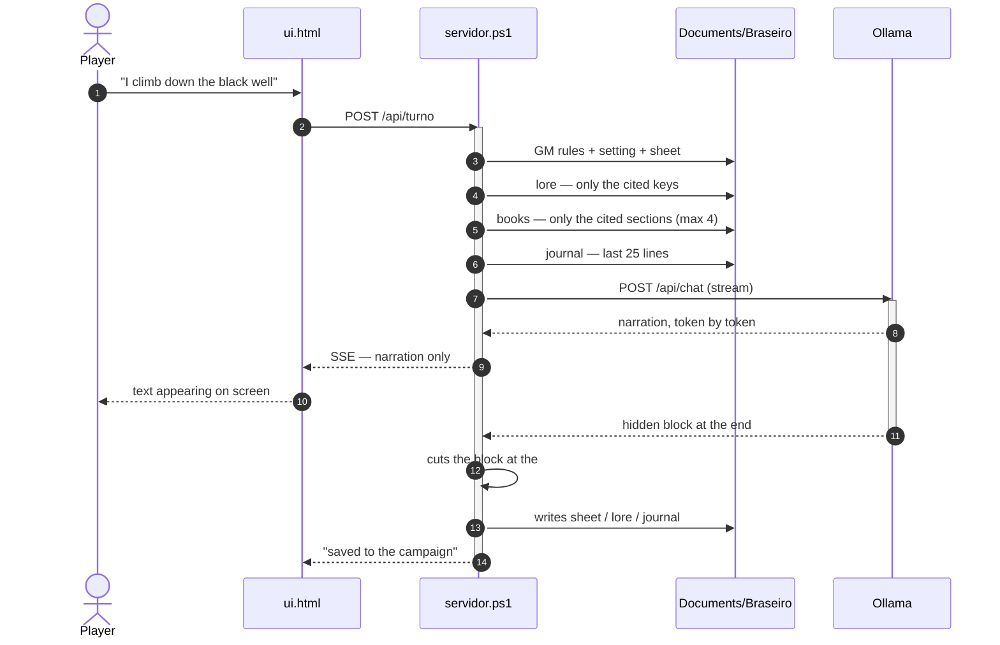
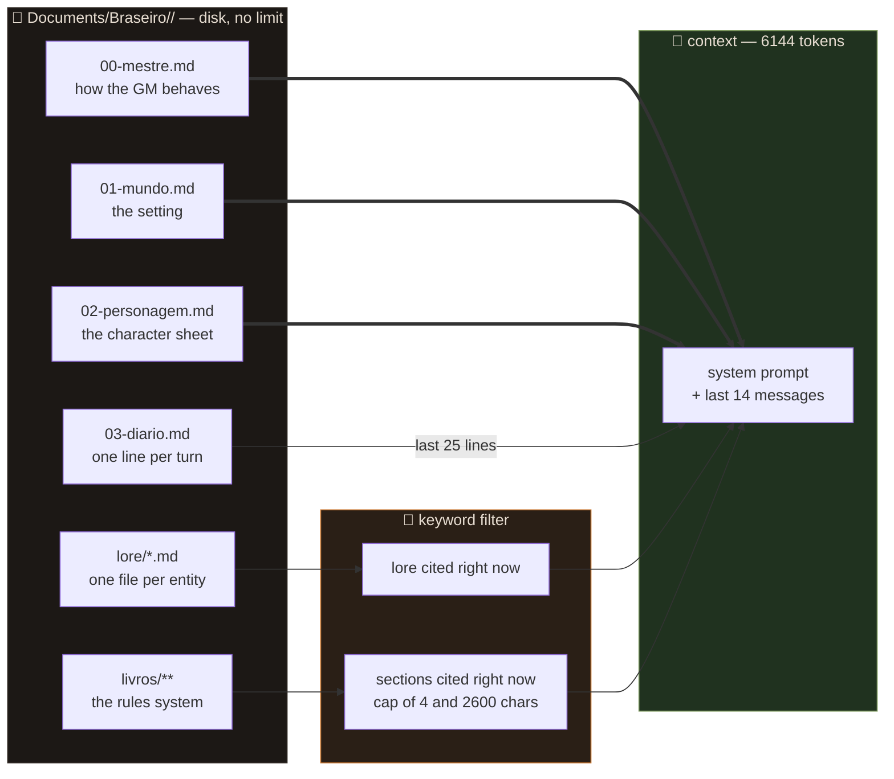
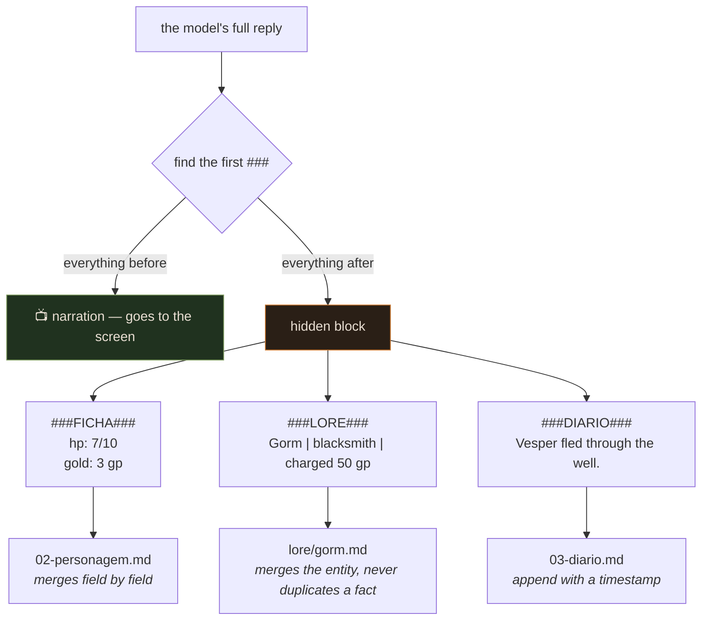

> 🇧🇷 [Português](README.md) · 🇬🇧 **English**

<h1 align="center">🔥 Braseiro</h1>

<p align="center">
  <strong>A tabletop RPG game master that fits on a flash drive.</strong><br>
  Runs 100% offline, installs nothing, and writes to its own campaign while you play.
</p>

<p align="center">
  
  
  
  
</p>

---

*Braseiro* is Portuguese for **brazier** — the fire you sit around to tell stories.

## What it is

Plug in the flash drive, click the flame icon, and a solo tabletop RPG opens in
your browser. The game master is a language model running on your own machine —
no internet, no account, no subscription, no content filter.

What separates this from "a chat with an AI" is what happens **after** every
reply: the GM writes the character sheet, a campaign journal, and one file per
NPC, place or secret that came up. On the next turn it reads back only what
matters.

A long campaign isn't solved with a big context window. It's solved with files.

## Why this isn't just a chat

| | plain chat | Braseiro |
|---|---|---|
| memory | ends when the context fills up | lives in files, no limit |
| character sheet | you remember and repeat it | it updates on its own |
| an NPC from 40 messages ago | forgotten | sits in `lore/` and returns when mentioned |
| the rulebook | doesn't fit | indexed per section, only the cited part enters |
| correcting it | argue in the chat | edit the file, effective immediately |

---

## How it works

### One turn, start to finish



The player never sees the hidden block. It is cut server-side, mid-stream: the
moment `###` shows up, text stops being sent to the screen and starts being
accumulated to become a disk write.

### Memory: what actually enters the context

This is the heart of the project. Disk has no limit; the context has 6144 tokens.



You can have 300 NPCs on file and spend 800 tokens. What wasn't mentioned doesn't
enter. Said "the blacksmith"? Gorm's file comes in. Didn't? It stays out.

### The hidden block

Every reply ends with a block the player never sees. The server parses it and
writes to the files:



Implementation details in [`docs/arquitetura.en.md`](docs/arquitetura.en.md).

---

## Requirements

Windows 10/11. **Nothing else** — no Python, no Node, no installer. The server is
PowerShell 5.1, which ships with Windows, and `HttpListener` opens a local port
without administrator privileges.

You need:

- **Portable Ollama** — [`ollama-windows-amd64.zip`](https://github.com/ollama/ollama/releases/latest), extracted into `bin/`
- **A GGUF model** — see the table below
- **~10 GB free** on the drive

### Picking a model by your VRAM

The bottleneck is **VRAM**, not RAM. And usable VRAM is smaller than the nominal
number: a 4 GB GTX 1650 hands you ~3.2 GB.

| usable VRAM | model | size | speed |
|---|---|---|---|
| ~3 GB | [Qwen3 8B](https://huggingface.co/bartowski/Qwen_Qwen3-8B-GGUF) Q4_K_M | 4.7 GB | ~10-14 tok/s |
| ~3 GB | [Mistral Nemo 12B](https://huggingface.co/bartowski/Mistral-Nemo-Instruct-2407-GGUF) Q4_K_M | 7.0 GB | ~4-6 tok/s |
| 8 GB+ | Mistral Nemo 12B Q4_K_M | 7.0 GB | ~25 tok/s |
| 12 GB+ | Mistral Small 24B | 14 GB | comfortable |

**Mistral Nemo 12B** is the default: better Portuguese and a better NPC voice. If
the wait bothers you, Qwen3 8B is nearly twice as fast with drier narration.

> Anything under 7B can't sustain a game master. It forgets the hidden block
> format, loses the thread of the scene, and starts summarizing instead of narrating.

---

## Install

**1.** Download [`ollama-windows-amd64.zip`](https://github.com/ollama/ollama/releases/latest)
(1.4 GB — CUDA support ships inside it, there is no separate zip) and extract its
contents into `bin/`, so that `bin/ollama.exe` exists.

**2.** Delete `bin/lib/ollama/cuda_v12` if your NVIDIA driver is 13.x. This isn't
fussiness: on a flash drive it costs ~96 seconds of waiting on every launch.
[Why](docs/diario-de-bordo.en.md#the-96-second-timeout).

**3.** Get a model in:

- `BAIXAR-MODELO.bat` — automatic, but slow (single connection)
- or download the `.gguf` in your browser **to the C: drive** and run `IMPORTAR-MODELO.bat`

> ⚠️ Never download the `.gguf` straight to the flash drive. `ollama create`
> **copies** the file into its store — 7 GB becomes 14 GB.

**4.** Run `CRIAR-ATALHO.bat` once. It drops a **Braseiro** shortcut, with the
flame icon, in the folder above — the drive root, if the project lives in
`X:\MesaRPG`. From then on you just click it.

---

## Where the campaign is saved

**Not on the flash drive.** Each table lives in:

```
Documents\Braseiro\<campaign name>\
```

The drive carries only the program. Campaigns stay on the computer, so they
survive losing the drive, get picked up by Windows backup, and you can run
several tables at once without one stepping on another.

The selector at the top of the right-hand panel switches tables, creates a new
one (**+ nova**), and opens the folder in Explorer (**📁**). Your choice is
written back to `config.txt` automatically.

A new campaign is born by copying the `modelo/` folder that ships with the
program — empty history, with the setting and the GM's rules ready for you to
rewrite.

---

## Usage

Write what your character does. That's it.

**Speaking out of character** — start the message with `mestre:` (`mestre` is
Portuguese for *game master*):

```
mestre: that NPC died last session, delete him
mestre: my character is one-handed, remember that
mestre: less description of smells, you're overdoing it
```

It doesn't narrate that as a scene: it takes the note, fixes the files, and
returns to the scene.

Case-insensitive, and the space after the colon is optional. `//` still works as
a short alias.

**Correcting things properly** — the right-hand panel edits any campaign file.
Save it and it applies on the next turn.

---

## The rulebooks

**Drag the files onto the Braseiro window.** That is it. They go into the open
campaign, PDFs are converted on the spot and indexed immediately — no restart, no
hunting for a folder. There is also a **📚 adicionar livros do sistema** button in
the panel if you would rather pick them through Explorer.

It replies in the chat saying how many went in and which ones failed, with the reason.

If you would rather do it by hand, the folder is `livros/` inside the campaign, with as many
subfolders as you like:

```
Documents/Braseiro/minha-campanha/livros/
├── dnd5e/
│   ├── combat.md
│   └── spells.md
└── my-setting/
    └── pantheon/
        └── gods.md
```

Cut them with `##` headings. Each section becomes its own indexed entry.

```markdown
## Traps
chaves: trap, disarm, rogue, trapdoor, vault, wire, latch

To spot one: Wisdom (Perception) against the DC, and only if the
character says they're searching.
```

**The `chaves:` line is what makes this work.** Nobody types "combat" — you write
*"I draw my sword and charge the orc"*. List the words you will actually use at
the table. (`chaves` is Portuguese for *keys*; the parser expects that exact word.)

**PDF works.** Drop the `.pdf` in and it becomes a `.pdf.txt` beside it, once —
extraction written in plain PowerShell, no dependency at all. For a big book, run
`CONVERTER-PDF.bat` first so it doesn't stall your first turn.

**Scanned** PDFs don't work (the page is a photo, there's no text underneath). In
that case it writes a `.pdf.aviso` explaining why and **indexes nothing from that
file** — half a book of garbled characters hurts a campaign more than no book at all.

Full guide in [`docs/livros.en.md`](docs/livros.en.md).

---

## Configuration

All in `config.txt`, in any text editor:

| key | default | what it does |
|---|---|---|
| `modelo` | `mistral-nemo:...` | which model Ollama uses |
| `contexto` | `6144` | context window; drop to 4096 if it stalls |
| `camadas_gpu` | `auto` | pin a number if you hit an out-of-memory error |
| `temperatura` | `0.85` | below 0.6 it gets repetitive |
| `historico` | `14` | recent messages kept in context |
| `porta` | `11500` | panel port |
| `campanha` | `minha-campanha` | which table to open (the panel selector also switches) |
| `pasta_campanhas` | *(empty)* | empty = `Documents\Braseiro`; fill in to use somewhere else |

The GM's **behaviour** is not configuration: it lives in your campaign's `00-mestre.md`,
which is read whole as a direct instruction. Want horror instead of fantasy, or a
different rules system? Rewrite that file.

---

## Project layout

```
braseiro/
├── INICIAR.bat              ← starts the engine, opens the browser
├── BAIXAR-MODELO.bat        ← ollama pull
├── IMPORTAR-MODELO.bat      ← imports a manually downloaded .gguf
├── CONVERTER-PDF.bat        ← converts the book PDFs, with progress
├── CRIAR-ATALHO.bat         ← drops the icon shortcut in the folder above
├── config.txt
│
├── mestre/
│   ├── servidor.ps1         ← HTTP + prompt + retrieval + writing
│   ├── pdf.ps1              ← PDF text extraction, plain PowerShell
│   ├── ui.html              ← interface, no framework, no build step
│   ├── importar.ps1
│   ├── converter.ps1
│   ├── atalho.ps1
│   └── braseiro.ico
│
├── modelo/                  ← seed for a new campaign (not live data)
│   ├── 00-mestre.md
│   ├── 01-mundo.md
│   ├── 02-personagem.md
│   ├── 03-diario.md
│   ├── lore/
│   └── livros/
│
├── bin/                     ← ollama.exe (not versioned)
└── models/                  ← Ollama's store (not versioned)
```

And your data, **off** the flash drive:

```
Documents/Braseiro/
├── minha-campanha/
│   ├── 00-mestre.md         ← you
│   ├── 01-mundo.md          ← you
│   ├── 02-personagem.md     ← both
│   ├── 03-diario.md         ← it
│   ├── lore/                ← it
│   └── livros/              ← you
└── a-mao-do-rei/            ← another table, independent
```

> File and folder names are Portuguese, and so is the GM's default voice. The
> `00-mestre.md` file in your campaign is a plain instruction file — rewrite it in English
> and the game master will run your table in English.

---

## Limitations

Things that **don't** work, said plainly:

- **It does not auto-run when you plug the drive in.** USB autorun has been
  disabled since Windows 7 and there is no safe workaround. The shortcut at the
  drive root is as close as it gets.
- **Scanned PDFs aren't read.** The page is an image and there is no OCR here.
  PDFs generated by a text editor work; scanned ones are refused with a warning,
  not silently.
- **Retrieval is keyword-based, not semantic.** If the word isn't in the heading
  or in `chaves:`, the section isn't found. That's deliberate — embeddings would
  mean a second model resident in VRAM, and there is none to spare.
- **Windows only.** The server depends on PowerShell 5.1's `System.Net.HttpListener`.
- **A small model forgets the format** after many turns. "Clear conversation"
  fixes it: the journal and the lore stay intact.
- **The first load from a flash drive is slow** — 7 GB moving over USB into RAM.

---

## Documentation

| | |
|---|---|
| [`docs/arquitetura.en.md`](docs/arquitetura.en.md) | HTTP routes, hidden-block protocol, retrieval algorithm |
| [`docs/memoria.en.md`](docs/memoria.en.md) | why files instead of a huge context window |
| [`docs/livros.en.md`](docs/livros.en.md) | rulebook format and how to index one well |
| [`docs/diario-de-bordo.en.md`](docs/diario-de-bordo.en.md) | what was measured, what broke, and why |

---

## License

MIT — see [LICENSE](LICENSE).

The example content in `modelo/` (Vallengard, the Grey Waste) is original and
ships under the same license. Any rulebooks **you** put in your campaign's `livros/` folder are
yours and have nothing to do with this repository.
