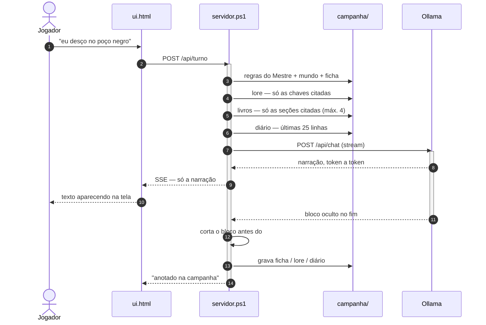
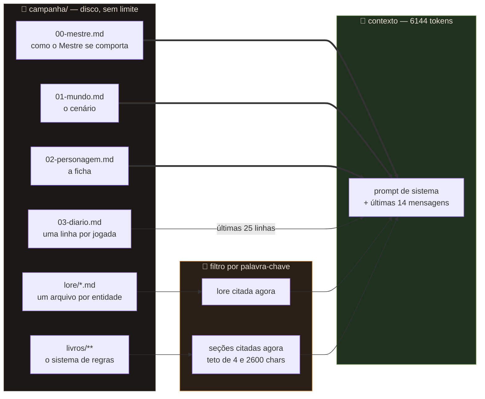
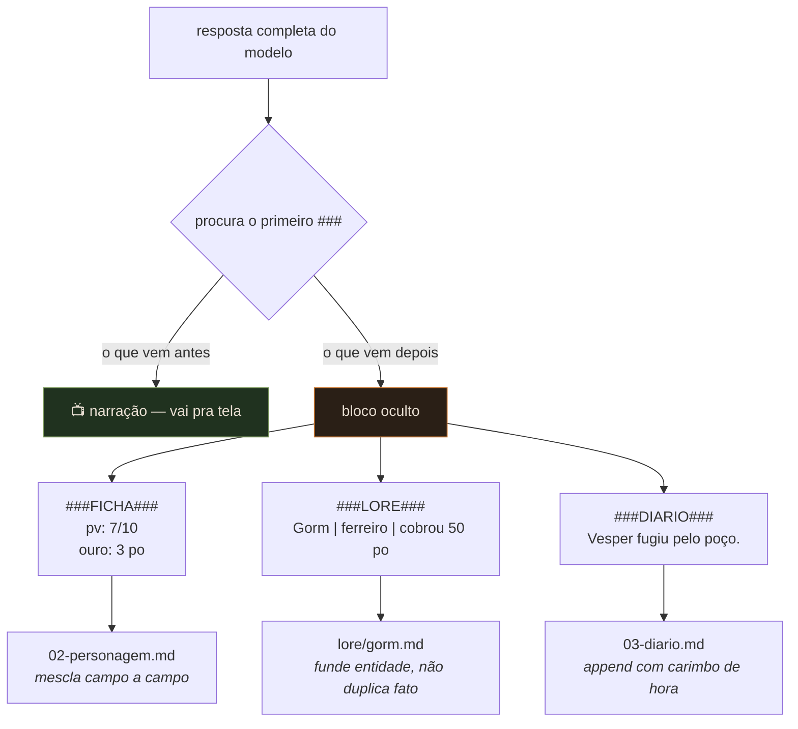

<h1 align="center">🔥 Braseiro</h1>

<p align="center">
  <strong>Um Mestre de RPG que cabe num pendrive.</strong><br>
  Roda 100% offline, não instala nada, e escreve na própria campanha enquanto vocês jogam.
</p>

<p align="center">
  
  
  
  
</p>

---

## O que é

Você pluga o pendrive, clica no ícone da chama, e abre uma mesa de RPG solo no
navegador. O Mestre é um modelo de linguagem rodando na sua máquina — sem
internet, sem conta, sem mensalidade, sem filtro de conteúdo.

O que separa isto de "um chat com IA" é o que acontece **depois** de cada
resposta: o Mestre grava sozinho a ficha do personagem, um diário da campanha e
um arquivo por NPC, lugar ou segredo que apareceu. Na jogada seguinte ele
relê só o que é relevante.

Campanha longa não se resolve com contexto grande. Se resolve com arquivo.

## Por que não é só um chat

| | chat comum | Braseiro |
|---|---|---|
| memória | acaba quando o contexto enche | vive em arquivos, sem limite |
| ficha | você lembra e repete | ele atualiza sozinho |
| NPC de 40 mensagens atrás | esqueceu | está em `lore/` e volta se citado |
| livro do sistema | não cabe | indexado por seção, entra só o trecho citado |
| correção | argumentar no chat | editar o arquivo, vale na hora |

---

## Como funciona

### Uma jogada, do começo ao fim



O jogador nunca vê o bloco oculto. Ele é cortado no servidor, no meio do
streaming: assim que aparece `###`, o texto para de ser enviado pra tela e
começa a ser acumulado pra virar escrita em disco.

### A memória: o que entra no contexto

Este é o coração do projeto. O disco não tem limite; o contexto tem 6144 tokens.



Você pode ter 300 NPCs anotados e gastar 800 tokens. O que não foi citado não
entra. Falou "o ferreiro"? Entra o arquivo do Gorm. Não falou? Não entra.

### O bloco oculto

Toda resposta termina com um bloco que o jogador não vê. O servidor o interpreta
e escreve nos arquivos:



Detalhes de implementação em [`docs/arquitetura.md`](docs/arquitetura.md).

---

## Requisitos

Windows 10/11. **Nada mais** — sem Python, sem Node, sem instalador. O servidor
é PowerShell 5.1, que já vem no Windows, e o `HttpListener` abre porta local sem
privilégio de administrador.

Você precisa de:

- **Ollama portátil** — [`ollama-windows-amd64.zip`](https://github.com/ollama/ollama/releases/latest), extraído em `bin/`
- **Um modelo GGUF** — veja a tabela abaixo
- **~10 GB livres** no pendrive

### Escolhendo o modelo pela sua VRAM

O gargalo é a **VRAM**, não a RAM. E VRAM utilizável é menor que a nominal:
uma GTX 1650 de 4 GB entrega ~3,2 GB.

| VRAM útil | modelo | tamanho | velocidade |
|---|---|---|---|
| ~3 GB | [Qwen3 8B](https://huggingface.co/bartowski/Qwen_Qwen3-8B-GGUF) Q4_K_M | 4,7 GB | ~10-14 tok/s |
| ~3 GB | [Mistral Nemo 12B](https://huggingface.co/bartowski/Mistral-Nemo-Instruct-2407-GGUF) Q4_K_M | 7,0 GB | ~4-6 tok/s |
| 8 GB+ | Mistral Nemo 12B Q4_K_M | 7,0 GB | ~25 tok/s |
| 12 GB+ | Mistral Small 24B | 14 GB | confortável |

**Mistral Nemo 12B** é o padrão: melhor português e melhor voz de NPC. Se a
espera incomodar, o Qwen3 8B é quase o dobro da velocidade com narração mais seca.

> Modelo abaixo de 7B não sustenta um Mestre. Ele esquece o formato do bloco
> oculto, perde o fio da cena e passa a resumir em vez de narrar.

---

## Instalação

**1.** Baixe [`ollama-windows-amd64.zip`](https://github.com/ollama/ollama/releases/latest)
(1,4 GB — o suporte a CUDA vem dentro dele, não existe zip separado) e extraia o
conteúdo em `bin/`, de forma que exista `bin/ollama.exe`.

**2.** Apague `bin/lib/ollama/cuda_v12` se o seu driver NVIDIA for 13.x.
Não é frescura: em pendrive isso custa ~96 segundos de espera a cada abertura.
[Por quê](docs/diario-de-bordo.md#o-timeout-de-96-segundos).

**3.** Ponha um modelo:

- `BAIXAR-MODELO.bat` — automático, mas lento (conexão única)
- ou baixe o `.gguf` pelo navegador **para o C:** e rode `IMPORTAR-MODELO.bat`

> ⚠️ Nunca baixe o `.gguf` direto pro pendrive. O `ollama create` **copia** o
> arquivo pro acervo — 7 GB viram 14 GB.

**4.** Rode `CRIAR-ATALHO.bat` uma vez. Ele põe um atalho **Braseiro**, com o
ícone da chama, na pasta acima — a raiz do pendrive, se o projeto estiver em
`X:\MesaRPG`. Daí em diante é só clicar nele.

---

## Uso

Escreva o que seu personagem faz. É isso.

**Falar fora da ficção** — comece a mensagem com `mestre:`

```
mestre: esse NPC morreu na sessão passada, apaga ele
mestre: meu personagem é maneta, lembra disso
mestre: menos descrição de cheiro, tá exagerado
```

Ele não narra isso como cena: acata, corrige os arquivos e volta pra cena.

Não diferencia maiúscula, e o espaço depois dos dois-pontos é opcional.
`//` continua funcionando como atalho curto.

**Corrigir de verdade** — o painel da direita edita qualquer arquivo da campanha.
Salvou, vale na jogada seguinte.

---

## Os livros do sistema

Ponha `.md` ou `.txt` em `campanha/livros/`, com subpastas à vontade:

```
campanha/livros/
├── dnd5e/
│   ├── combate.md
│   └── magias.md
└── meu-cenario/
    └── panteao/
        └── deuses.md
```

Corte com títulos `##`. Cada seção vira uma entrada indexada.

```markdown
## Armadilhas
chaves: armadilha, desarmar, ladino, alcapao, cofre, fio, trava

Para perceber: Sabedoria (Percepção) contra a CD, e só se o
personagem disser que está procurando.
```

**A linha `chaves:` é o que faz isso funcionar.** Ninguém digita "combate" —
você escreve *"saco a espada e parto pra cima do orc"*. Liste as palavras que
você realmente vai usar jogando.

**PDF funciona.** Solte o `.pdf` na pasta e ele vira um `.pdf.txt` do lado, uma
vez só — extração em PowerShell puro, sem dependência nenhuma. Livro grande:
rode `CONVERTER-PDF.bat` antes, pra não travar a primeira jogada.

PDF **escaneado** não dá (a página é foto, não tem texto por baixo). Nesse caso
ele grava um `.pdf.aviso` explicando e **não indexa nada daquele arquivo** — meio
livro em garrancho estraga mais a campanha do que livro nenhum.

Guia completo em [`docs/livros.md`](docs/livros.md).

---

## Configuração

Tudo em `config.txt`, num editor de texto qualquer:

| chave | padrão | o que faz |
|---|---|---|
| `modelo` | `mistral-nemo:...` | qual modelo o Ollama usa |
| `contexto` | `6144` | janela de contexto; baixe pra 4096 se travar |
| `camadas_gpu` | `auto` | fixe um número se der erro de memória |
| `temperatura` | `0.85` | abaixo de 0.6 fica repetitivo |
| `historico` | `14` | mensagens recentes no contexto |
| `porta` | `11500` | porta do painel |

O **comportamento** do Mestre não é config: está em `campanha/00-mestre.md`, que
é lido inteiro como ordem direta. Quer terror em vez de fantasia, ou outro
sistema de regras? Reescreva esse arquivo.

---

## Estrutura do projeto

```
braseiro/
├── INICIAR.bat              ← liga o motor, abre o navegador
├── BAIXAR-MODELO.bat        ← ollama pull
├── IMPORTAR-MODELO.bat      ← importa um .gguf baixado à mão
├── CONVERTER-PDF.bat        ← converte os PDF dos livros, com progresso
├── CRIAR-ATALHO.bat         ← põe o atalho com ícone na pasta acima
├── config.txt
│
├── mestre/
│   ├── servidor.ps1         ← HTTP + prompt + recuperação + escrita
│   ├── pdf.ps1              ← extração de texto de PDF, PowerShell puro
│   ├── ui.html              ← interface, sem framework, sem build
│   ├── importar.ps1
│   ├── converter.ps1
│   ├── atalho.ps1
│   └── braseiro.ico
│
├── campanha/                ← seus dados; o Mestre lê e escreve aqui
│   ├── 00-mestre.md         ← você
│   ├── 01-mundo.md          ← você
│   ├── 02-personagem.md     ← os dois
│   ├── 03-diario.md         ← ele
│   ├── lore/                ← ele
│   └── livros/              ← você
│
├── bin/                     ← ollama.exe (não versionado)
└── models/                  ← acervo do Ollama (não versionado)
```

---

## Limitações

Coisas que **não** funcionam, ditas na cara:

- **Não roda sozinho ao plugar o pendrive.** O autorun de USB está desativado
  desde o Windows 7 e não há contorno seguro. O atalho na raiz é o mais perto disso.
- **PDF escaneado não é lido.** A página é imagem e não há OCR aqui. PDF gerado
  por editor de texto funciona; o escaneado é recusado com aviso, não silenciosamente.
- **A recuperação é por palavra-chave, não semântica.** Se a palavra não está no
  título nem em `chaves:`, a seção não é encontrada. É simples de propósito —
  embeddings exigiriam um segundo modelo carregado, e a VRAM não sobra.
- **Só Windows.** O servidor depende de `System.Net.HttpListener` do PowerShell 5.1.
- **Modelo pequeno esquece o formato** depois de muitas jogadas. "Apagar conversa"
  resolve: o diário e a lore continuam intactos.
- **O primeiro carregamento é lento em pendrive** — 7 GB saindo do USB pra RAM.

---

## Documentação

| | |
|---|---|
| [`docs/arquitetura.md`](docs/arquitetura.md) | rotas HTTP, protocolo do bloco oculto, algoritmo de recuperação |
| [`docs/memoria.md`](docs/memoria.md) | por que arquivo em vez de contexto grande |
| [`docs/livros.md`](docs/livros.md) | formato dos livros e como indexar bem |
| [`docs/diario-de-bordo.md`](docs/diario-de-bordo.md) | o que foi medido, o que quebrou e por quê |

---

## Licença

MIT — veja [LICENSE](LICENSE).

O conteúdo de exemplo em `campanha/` (Vallengard, o Ermo Cinzento) é original e
vai junto na mesma licença. Os livros de sistema que **você** colocar em
`campanha/livros/` são seus e não têm nada a ver com este repositório.
