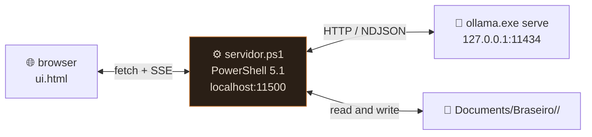
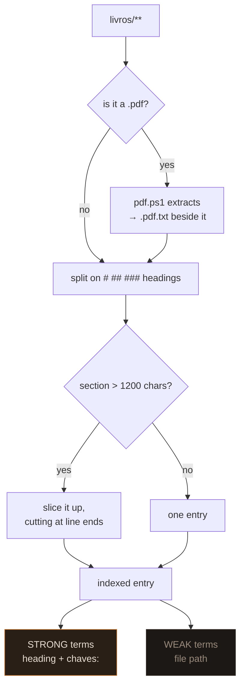

> 🇧🇷 [Português](arquitetura.md) · 🇬🇧 **English**

# Architecture

Three processes, none of them installed.



`INICIAR.bat` starts Ollama with `OLLAMA_MODELS` pointing inside the flash drive
itself, waits for port 11434 to open, starts `servidor.ps1`, and opens the browser.

## Why PowerShell

The target machine had neither Python nor Node, and installing a runtime defeats
the point of being portable. `System.Net.HttpListener` opens
`http://localhost:<port>/` **without administrator privileges**, which solves the
whole problem with what already ships in Windows.

It also removes CORS from the picture: the page is served by the same process
that talks to Ollama, so `OLLAMA_ORIGINS` never has to be touched.

## Routes

| method | route | what it does |
|---|---|---|
| `GET` | `/` | serves `ui.html` |
| `GET` | `/api/estado` | campaign files + history + book index |
| `POST` | `/api/turno` | one turn — responds over **SSE** |
| `POST` | `/api/salvar` | saves a file edited in the panel |
| `POST` | `/api/apagar-conversa` | clears only the short history |

The loop is single-threaded. It's a single-player game; concurrency would be
complexity with no payoff.

### `/api/salvar` and path traversal

The `id` is validated against `^(lore/)?[^/]+\.md$` and rejects any `..`. Virtual
ids starting with `__` (like the `__livros` index) don't match the pattern, which
makes them read-only in the server, not just in the interface.

## The hidden-block protocol

The system prompt requires every reply to end like this:

```
###FICHA###
pv: 7/10
ouro: 3 po
###LORE###
Gorm Martelo-Torto | gorm, ferreiro | Charged 50 gp up front for the blade.
###DIARIO###
Vesper bribed Arvid and fled through the Black Well.
###FIM###
```

Text delimiters were chosen over JSON or tool calling for a practical reason:
**8-12B models get JSON wrong often**, and roleplay finetunes usually lose the
base model's tool-calling ability. Lines separated by `|` tolerate mistakes — if
one line comes out malformed it is discarded and the others still land.

### Cutting during the stream

The server can't wait for the reply to finish before deciding what to show —
streaming is what makes 5 tok/s bearable. So it cuts live:

```powershell
$i = $full.IndexOf("###")
if ($i -ge 0) {
    # found it: emit up to here and stop emitting for good
} else {
    # not found: emit everything but the last 3 chars,
    # so a "###" can't be split across two chunks
    $seguro = $full.Length - 3
}
```

Holding back 3 characters is enough because the delimiter is exactly 3 long.

### Writing to the files

| section | destination | strategy |
|---|---|---|
| `###FICHA###` | `02-personagem.md` | merges **field by field** via regex; a new field is inserted under `## Ficha` |
| `###LORE###` | `lore/<slug>.md` | merged by key; a repeated fact isn't duplicated |
| `###DIARIO###` | `03-diario.md` | append with a `dd/MM HH:mm` stamp |

Entity merging deserves a note. If the model writes "Gorm" on one turn and "Gorm
Martelo-Torto" on the next, a naive slug would create two files and the lore
would split in half. So before creating anything, the server scans the existing
files and compares key sets — if they intersect, it reuses the file and
**accumulates** the keys.

A new fact is only appended if the normalized text isn't already there.

## Retrieval

Two indexes, same idea, different budgets.

### Lore

Each `lore/*.md` carries frontmatter with `chaves:`. On every turn the server
normalizes (accent-free, lowercase) the last 8 messages plus the new input, and
injects every entry whose key (≥ 3 characters) appears in that text. Capped at 12.

### Books

More elaborate, because a rulebook is large.



Terms are truncated at 6 characters, which handles plurals and conjugation for
free: `armadilhas → armadi` matches both "armadilha" and "armadilhas";
`combate → combat` matches "combater".

**Only strong terms fire a section.** Weak ones count toward the score
(`strong × 3 + weak`) but never on their own. Without that separation, a word
from the filename would pull every section in that file at once — which is
exactly what happened on the first test run.

Results are sorted by score and capped at **4 sections or 2600 characters**,
whichever comes first.

When a chunk has no real heading (common for converted PDFs), the strong terms
are derived from the chunk's **own text** — its most repeated words. Otherwise
that chunk would be unreachable, since only strong terms fire.

### Index cache

Re-reading dozens of files from a flash drive on every turn would be slow. The
index lives in memory behind a stamp built from `path + LastWriteTimeUtc` of all
files. If the stamp doesn't change, nothing is re-read. Saved a new file? The
stamp changes and the index rebuilds on the next turn, no restart needed.

## PDF extraction

`mestre/pdf.ps1`, zero dependencies. It:

1. reads the file as bytes and maps them 1:1 to chars via Latin-1, so string
   indexes line up with byte offsets;
2. finds every `stream` … `endstream` pair and reads the dictionary before it;
3. skips `/Subtype /Image` and `/FontFile`;
4. for `/FlateDecode`, **skips the 2-byte zlib header** and inflates with
   `DeflateStream`, which only understands raw deflate;
5. walks the text operators: literal strings with nesting and octal escapes, hex
   strings, and kerning below -100 inside a `TJ` array becoming a space.

PDFs have no `##`, so the converter promotes short lines (≤ 60 chars) that don't
end in punctuation and are either ALL CAPS or isolated by a blank line — which is
how RPG book chapters normally appear.

It refuses rather than degrade. A scanned PDF has no text underneath, and a font
with a private encoding and no `ToUnicode` map comes out as garbage. Both cases
are detected (extracted length, and the ratio of sane characters) and write a
`.pdf.aviso` with the reason instead of indexing anything.

## Encoding — the PowerShell 5.1 trap

**Windows PowerShell 5.1 reads `.ps1` files as ANSI when there is no BOM.** Any
accented literal inside the script silently turns to garbage: no error, `-match`
just stops matching.

Two defenses in this project:

1. the `.ps1` files are written as **UTF-8 with BOM**;
2. the code itself is kept **accent-free**, with all accented text living in data
   files read with an explicit encoding.

Everywhere else, encoding is explicit:

```powershell
[System.IO.File]::ReadAllText($p, [System.Text.Encoding]::UTF8)
[System.IO.File]::WriteAllText($p, $t, (New-Object Text.UTF8Encoding($false)))
```

Never `Set-Content`/`Get-Content` without `-Encoding` — the 5.1 default is the
system ANSI code page, and that corrupts Portuguese.

The `.bat` files are **pure ASCII**: even with `chcp 65001`, accents in a batch
file are a source of mojibake depending on the console.
