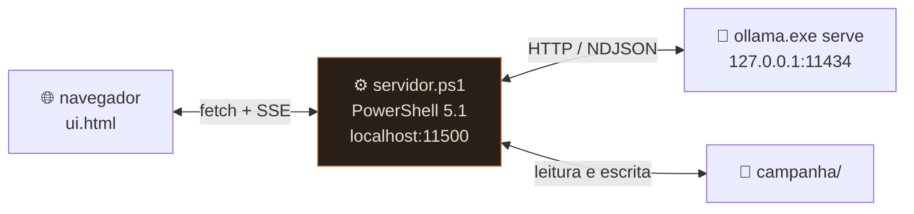
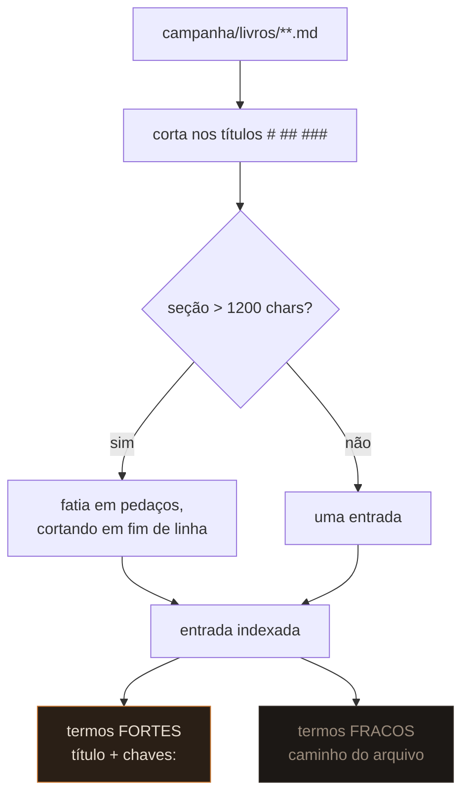

# Arquitetura

Três processos, nenhum instalado.



`INICIAR.bat` sobe o Ollama com `OLLAMA_MODELS` apontando pra dentro do próprio
pendrive, espera a porta 11434 abrir, sobe o `servidor.ps1` e abre o navegador.

## Por que PowerShell

A máquina-alvo não tinha Python nem Node, e instalar runtime derrota o propósito
de ser portátil. `System.Net.HttpListener` abre `http://localhost:<porta>/` **sem
privilégio de administrador**, o que resolve o problema inteiro com o que já vem
no Windows.

Isso também elimina CORS: a página é servida pelo mesmo processo que fala com o
Ollama, então não precisa mexer em `OLLAMA_ORIGINS`.

## Rotas

| método | rota | o que faz |
|---|---|---|
| `GET` | `/` | serve `ui.html` |
| `GET` | `/api/estado` | arquivos da campanha + histórico + índice de livros |
| `POST` | `/api/turno` | uma jogada — responde em **SSE** |
| `POST` | `/api/salvar` | grava um arquivo editado no painel |
| `POST` | `/api/apagar-conversa` | zera só o histórico curto |

O laço é single-thread. É um jogo de um jogador só; concorrência seria
complexidade sem ganho.

### `/api/salvar` e path traversal

O `id` é validado contra `^(lore/)?[^/]+\.md$` e rejeita qualquer `..`. Ids
virtuais começando com `__` (como o índice `__livros`) não casam com o padrão e
por isso são somente-leitura no servidor, não só na interface.

## O protocolo do bloco oculto

O prompt de sistema exige que toda resposta termine assim:

```
###FICHA###
pv: 7/10
ouro: 3 po
###LORE###
Gorm Martelo-Torto | gorm, ferreiro | Cobrou 50 po adiantado pela lâmina.
###DIARIO###
Vesper subornou Arvid e fugiu pelo Poço Negro.
###FIM###
```

Escolhi delimitadores de texto em vez de JSON ou *tool calling* por um motivo
prático: **modelos de 8-12B erram JSON com frequência**, e finetunes de roleplay
costumam perder a capacidade de tool calling do modelo base. Linhas separadas por
`|` toleram erro — se uma linha vier torta, ela é descartada e as outras entram.

### Corte durante o streaming

O servidor não pode esperar a resposta terminar pra decidir o que mostrar — o
streaming é o que torna 5 tok/s suportável. Então ele corta ao vivo:

```powershell
$i = $full.IndexOf("###")
if ($i -ge 0) {
    # achou: emite até aqui e para de emitir pra sempre
} else {
    # não achou: emite tudo menos os 3 últimos chars,
    # pra não partir um "###" no meio de dois chunks
    $seguro = $full.Length - 3
}
```

Segurar 3 caracteres é o suficiente porque o delimitador tem exatamente 3.

### Escrita nos arquivos

| seção | destino | estratégia |
|---|---|---|
| `###FICHA###` | `02-personagem.md` | mescla **campo a campo** por regex; campo novo é inserido sob `## Ficha` |
| `###LORE###` | `lore/<slug>.md` | funde por chave; fato repetido não duplica |
| `###DIARIO###` | `03-diario.md` | append com carimbo `dd/MM HH:mm` |

A fusão de entidade merece nota. Se o modelo escreve "Gorm" numa jogada e "Gorm
Martelo-Torto" na outra, um slug ingênuo criaria dois arquivos e a lore se
partiria. Então antes de criar, o servidor varre os arquivos existentes e
compara o conjunto de chaves — se cruza, reusa o arquivo e **acumula** as chaves.

Fato novo só é acrescentado se o texto normalizado ainda não estiver lá.

## Recuperação

Dois índices, mesma ideia, orçamentos diferentes.

### Lore

Cada `lore/*.md` tem *frontmatter* com `chaves:`. A cada jogada, o servidor
normaliza (sem acento, minúsculo) as últimas 8 mensagens + a entrada, e injeta
toda entrada cuja chave (≥ 3 caracteres) apareça no texto. Teto de 12.

### Livros

Mais elaborado, porque um manual é grande.



Os termos são truncados em 6 caracteres, o que resolve plural e conjugação de
graça: `armadilhas → armadi` casa com "armadilha" e "armadilhas"; `combate →
combat` casa com "combater".

**Só termos fortes disparam uma seção.** Os fracos entram na pontuação
(`forte × 3 + fraco`) mas nunca sozinhos. Sem essa separação, uma palavra do nome
do arquivo puxaria todas as seções dele de uma vez — foi exatamente o que
aconteceu no primeiro teste.

O resultado é ordenado por pontuação e cortado em **4 seções ou 2600 caracteres**,
o que vier primeiro.

### Cache do índice

Reler dezenas de arquivos de um pendrive a cada jogada seria lento. O índice fica
em memória com um selo formado por `caminho + LastWriteTimeUtc` de todos os
arquivos. Se o selo não muda, não relê. Salvou um arquivo novo? O selo muda e o
índice se refaz na jogada seguinte, sem reiniciar nada.

## Codificação — a armadilha do PowerShell 5.1

**Windows PowerShell 5.1 lê arquivos `.ps1` como ANSI quando não há BOM.**
Qualquer literal acentuado dentro do script vira lixo silenciosamente: nenhum
erro, o `-match` só para de casar.

Duas defesas no projeto:

1. os `.ps1` são gravados em **UTF-8 com BOM**;
2. o código é mantido **sem acentos**, com todo texto acentuado vivendo em
   arquivos de dados lidos com encoding explícito.

Em todo o resto, encoding é explícito:

```powershell
[System.IO.File]::ReadAllText($p, [System.Text.Encoding]::UTF8)
[System.IO.File]::WriteAllText($p, $t, (New-Object Text.UTF8Encoding($false)))
```

Nunca `Set-Content`/`Get-Content` sem `-Encoding` — o padrão do 5.1 é a página de
código ANSI do sistema, e isso corrompe português.

Os `.bat` são **ASCII puro**: mesmo com `chcp 65001`, acento em arquivo de lote é
fonte de mojibake dependendo do console.
