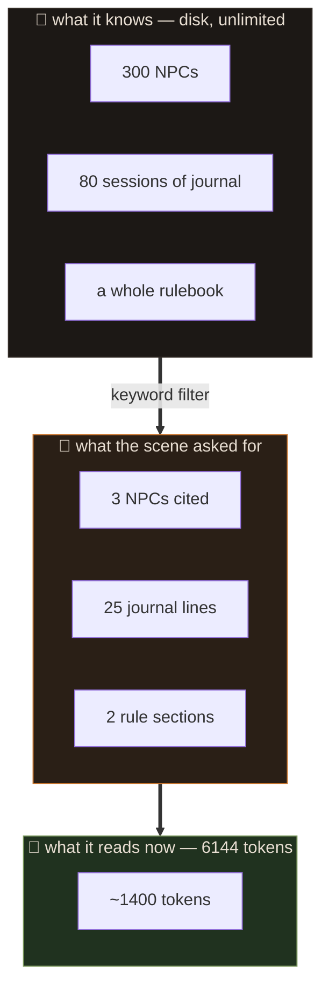

> 🇧🇷 [Português](memoria.md) · 🇬🇧 **English**

# Memory

## The common mistake

Everyone's first instinct is: *"it's local, so memory isn't a problem — just use
a huge context window."*

Both halves are wrong.

**Context costs VRAM.** The KV cache grows linearly with token count. On a
Mistral Nemo 12B that's ~160 KB per token; 8192 tokens is 1.3 GB of cache alone,
competing with 7 GB of weights on a card with 3.2 GB usable.

**And a full context makes the model worse.** A 12B with 100k tokens filled in
doesn't remember better: it dilutes attention, loses the instructions from the
start, and begins repeating itself. The problem isn't fitting. It's that fitting
doesn't help.

## The way out

Separate **what the GM knows** from **what the GM is reading right now**.



Measured on a real turn with a rulebook indexed: **~1400 tokens** of system
prompt out of a 6144 budget. Plenty of room left for the conversation.

## The four layers

### 1. Fixed — always included

`00-mestre.md` (behaviour) and `01-mundo.md` (setting). Both are read whole every
turn, so keep them lean — a page each. That's the system's fixed cost.

### 2. The sheet — always included, always current

`02-personagem.md`. Small by nature. The GM rewrites it field by field through
the hidden block; you fix it by hand when it gets something wrong.

### 3. The journal — compressed long-term memory

`03-diario.md` gains **one line per turn**, written by the GM itself. The **last
25** go into the context.

This is what replaces "remembering the whole conversation": the summary was
already written at the moment the fact happened, by the party that had the full
context in hand. Compressing after the fact always loses more.

When a line falls out of the 25-line window the fact isn't gone — if it mattered,
it also became a lore entry.

### 4. Lore and books — associative memory

They enter only when cited. This is the layer with no size limit.

```
lore/gorm-martelo-torto.md
---
chaves: Gorm Martelo-Torto, gorm, ferreiro, martelo-torto
---
**Gorm Martelo-Torto**
Dwarf blacksmith of Vallengard. Owes the Guild 200 gp and pretends he doesn't.
Charged 50 gp up front for Vesper's blade.
```

Said "blacksmith"? It's in. Didn't? It stays out and costs nothing.

## Why keywords and not embeddings

Semantic search would be better. It would find "the man at the anvil" without
anyone typing "blacksmith".

It isn't possible, for the usual reason: **3.2 GB of VRAM**. An embedding model
loaded alongside the GM either fights for the card or runs on CPU and slows every
turn. On a 12 GB card the math would change.

The mitigation is the `chaves:` line, which lets you teach the synonyms by hand.
Less elegant, zero cost, and it works — as long as you're generous with the list.

## What to do when it forgets

| symptom | cause | fix |
|---|---|---|
| forgot an NPC | no lore entry, or the key doesn't match | edit `lore/`, add keys |
| forgot a fact from the session | fell out of the 25 journal lines | promote it to a lore fact |
| ignores a rule | the book section wasn't found | add words to `chaves:` |
| wrong sheet values | it made them up | fix it in the panel; applies next turn |
| stopped writing notes | the model lost the format | "clear conversation" — journal and lore stay |
