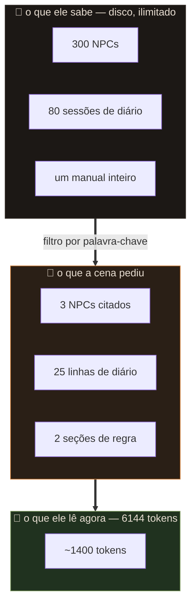

# A memória

## O erro comum

A intuição de todo mundo é: *"é local, então a memória não é problema — é só usar
um contexto gigante."*

As duas metades estão erradas.

**Contexto custa VRAM.** O cache KV cresce linearmente com o número de tokens. Num
Mistral Nemo 12B são ~160 KB por token; 8192 tokens = 1,3 GB só de cache, disputando
espaço com os 7 GB de pesos numa placa que tem 3,2 GB úteis.

**E contexto cheio deixa o modelo pior.** Um 12B com 100k tokens preenchidos não
lembra melhor: ele dilui a atenção, perde instrução do começo e passa a repetir.
O problema não é caber. É que não adianta caber.

## A saída

Separar **o que o Mestre sabe** de **o que o Mestre está lendo agora**.



Medido numa jogada real com um livro de sistema indexado: **~1400 tokens** de
prompt de sistema, de um teto de 6144. Sobra folga pra conversa.

## As quatro camadas

### 1. Fixo — sempre entra

`00-mestre.md` (comportamento) e `01-mundo.md` (cenário). São lidos inteiros toda
jogada, então mantenha-os enxutos: uma página cada. É o custo fixo do sistema.

### 2. Ficha — sempre entra, sempre atualizada

`02-personagem.md`. Pequena por natureza. O Mestre reescreve campo a campo pelo
bloco oculto; você corrige à mão quando ele errar.

### 3. Diário — memória longa comprimida

`03-diario.md` ganha **uma linha por jogada**, escrita pelo próprio Mestre. Entram
no contexto as **últimas 25**.

É isto que substitui "lembrar da conversa toda": o resumo já foi feito no momento
em que o fato aconteceu, por quem tinha o contexto inteiro na mão. Comprimir depois
sempre perde mais.

Quando uma linha sai da janela de 25, o fato não some — se for importante, ele
também virou entrada de lore.

### 4. Lore e livros — memória associativa

Entram só quando citados. Esta é a camada sem limite de tamanho.

```
lore/gorm-martelo-torto.md
---
chaves: Gorm Martelo-Torto, gorm, ferreiro, martelo-torto
---
**Gorm Martelo-Torto**
Ferreiro anão de Vallengard. Deve 200 po à Guilda e finge que não.
Cobrou 50 po adiantado pela lâmina de Vesper.
```

Falou "ferreiro"? Entra. Não falou? Não entra, não custa nada.

## Por que palavra-chave e não embeddings

Busca semântica seria melhor. Encontraria "o homem da bigorna" sem que ninguém
escrevesse "ferreiro".

Não dá, e o motivo é o mesmo de sempre: **3,2 GB de VRAM**. Um modelo de embedding
carregado junto com o Mestre ou disputa a placa ou vai pra CPU e atrasa cada
jogada. Numa máquina com 12 GB de VRAM a conta mudaria.

A mitigação é a linha `chaves:`, que deixa você ensinar os sinônimos à mão. Menos
elegante, custo zero, e funciona — desde que você seja generoso na lista.

## O que fazer quando ele esquece

| sintoma | causa | conserto |
|---|---|---|
| esqueceu um NPC | não tinha entrada de lore, ou a chave não bate | edite `lore/`, acrescente chaves |
| esqueceu um fato da sessão | saiu das 25 linhas do diário | promova a fato de lore |
| ignora uma regra | a seção do livro não foi encontrada | acrescente palavras em `chaves:` |
| ficha errada | ele inventou | corrija no painel; vale na jogada seguinte |
| parou de anotar | modelo perdeu o formato | "apagar conversa" — diário e lore ficam |
